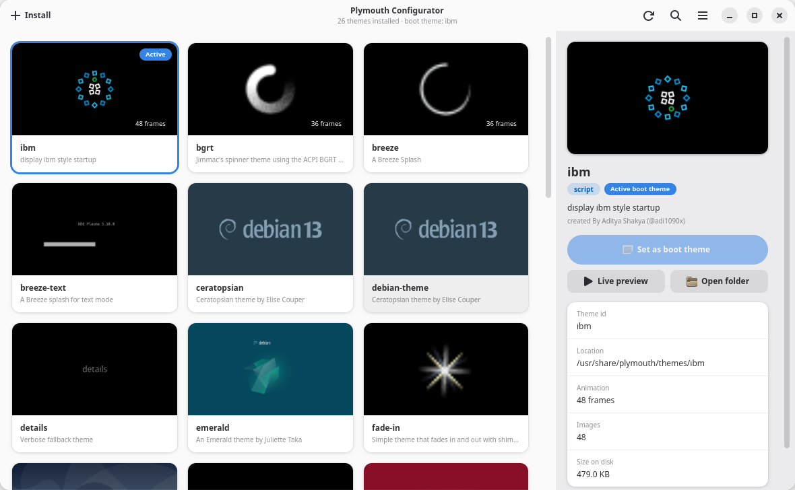

# Plymouth Configurator

A desktop app for managing [Plymouth](https://www.freedesktop.org/wiki/Software/Plymouth/)
boot splash themes. It shows every installed theme in a grid with a live,
animated preview rendered from the theme's own frames, and lets you apply,
live-preview, install and remove themes without touching the terminal.



## Features

- **Grid of animated previews.** Each card paints the theme's background
  gradient (parsed from its `.script` or `.plymouth`), its background image
  and its animation frames. Hover a card to play the animation.
- **Details sidebar** with description, author comment, module, location,
  frame count and size on disk.
- **Set as boot theme.** Runs `plymouth-set-default-theme`, registers the
  theme with `update-alternatives` on Debian-based systems, and rebuilds the
  initramfs with whichever tool the distribution uses (`update-initramfs`,
  `mkinitcpio` or `dracut`). The rebuild can be turned off in the menu.
- **Live preview.** Runs `plymouthd` on your current display for a few
  seconds using `plymouth.splash=<theme>`, so you can watch the real thing
  without changing the default. Needs Plymouth's x11 renderer
  (`plymouth-x11` on Debian/Ubuntu).
- **Install themes** from a folder, from a zip/tar archive, or straight from
  the [adi1090x/plymouth-themes](https://github.com/adi1090x/plymouth-themes)
  collection (80+ themes). A picker shows previews of everything found and
  lets you install several at once. `.plymouth` paths are rewritten to the
  install location.
- **Uninstall** themes you no longer want (the active theme is protected).
- Search, keyboard shortcuts (`Ctrl+F`, `F5`, `Ctrl+O`), and a
  responsive layout that collapses the sidebar on narrow windows.

All privileged operations go through a small standalone helper
(`plymouth_configurator/helper.py`) launched with `pkexec`, so you get a
normal polkit password prompt and only those specific actions run as root.

## Requirements

- Python 3.11+
- GTK 4.10+ and libadwaita 1.5+ with PyGObject
- Pillow
- polkit (`pkexec`) for privileged actions
- Plymouth itself; optionally `plymouth-x11` for live previews

Debian / Ubuntu:

```bash
sudo apt install python3-gi gir1.2-gtk-4.0 gir1.2-adw-1 python3-pil plymouth plymouth-x11 policykit-1
```

Arch:

```bash
sudo pacman -S python-gobject gtk4 libadwaita python-pillow plymouth polkit
```

Fedora:

```bash
sudo dnf install python3-gobject gtk4 libadwaita python3-pillow plymouth plymouth-plugin-script polkit
```

## Running

```bash
git clone https://github.com/anolis/plymouth-configurator.git
cd plymouth-configurator
./plymouth-configurator          # run from the checkout
make install                     # optional: launcher + app-menu entry in ~/.local
```

## How it applies a theme

1. `plymouth-set-default-theme <name>` writes `Theme=<name>` to
   `/etc/plymouth/plymouthd.conf` (or the helper writes it directly if the
   tool is missing).
2. On systems that manage `default.plymouth` through `update-alternatives`,
   the theme is registered and selected there too.
3. The initramfs is regenerated so the new splash is available at boot.

## Manual use of the helper

Everything the GUI does with elevated rights can also be run by hand:

```bash
sudo python3 plymouth_configurator/helper.py set-default angular
sudo python3 plymouth_configurator/helper.py install ~/plymouth-themes/pack_1/angular
sudo python3 plymouth_configurator/helper.py uninstall angular
sudo python3 plymouth_configurator/helper.py preview angular --seconds 15 --display "$DISPLAY"
sudo python3 plymouth_configurator/helper.py rebuild-initrd
```

## Layout

| File | Purpose |
| --- | --- |
| `plymouth_configurator/themes.py` | Theme discovery, `.plymouth` parsing, preview analysis (frames, background, colours) |
| `plymouth_configurator/widgets.py` | `ThemePreview` renderer and `ThemeCard` grid tile |
| `plymouth_configurator/window.py` | Main window, details sidebar, actions |
| `plymouth_configurator/installer.py` | Folder / archive / collection sources and the picker dialog |
| `plymouth_configurator/system.py` | Distro detection, settings, `pkexec` runner |
| `plymouth_configurator/helper.py` | Standalone root helper |

## License

MIT. Themes from the adi1090x collection keep their own licenses.
